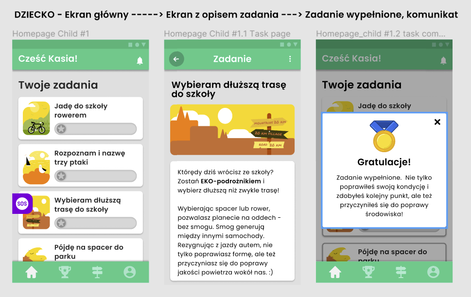
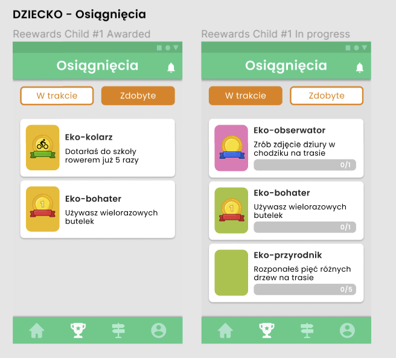
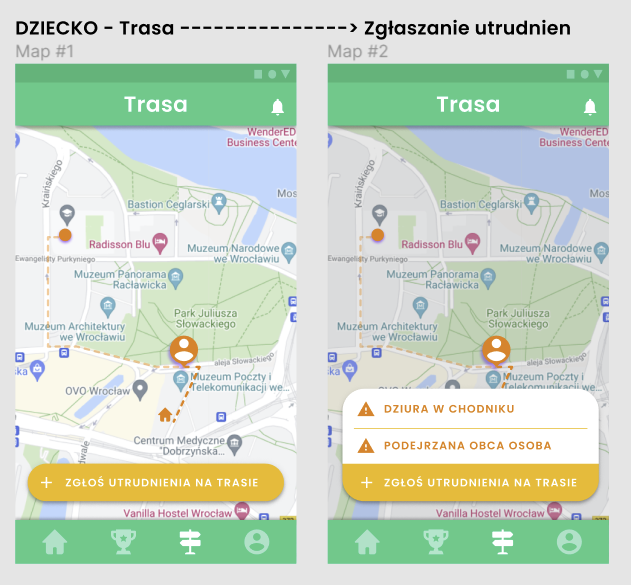
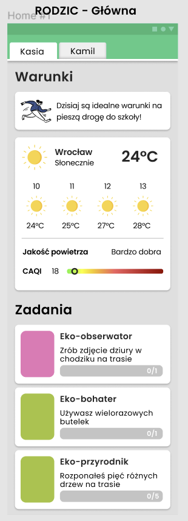
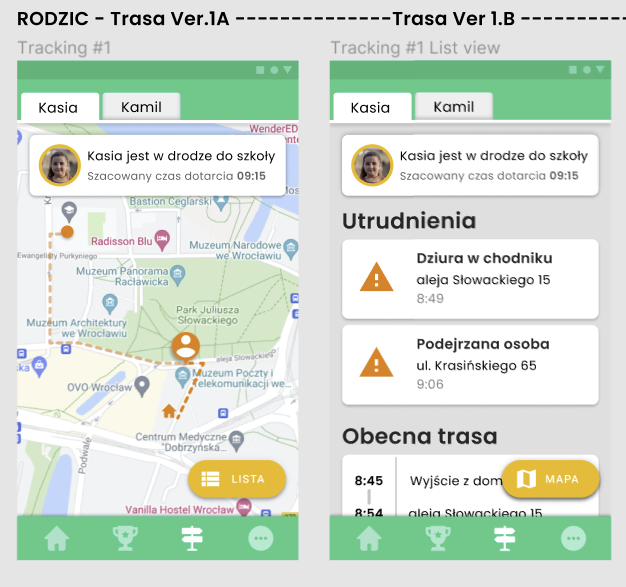
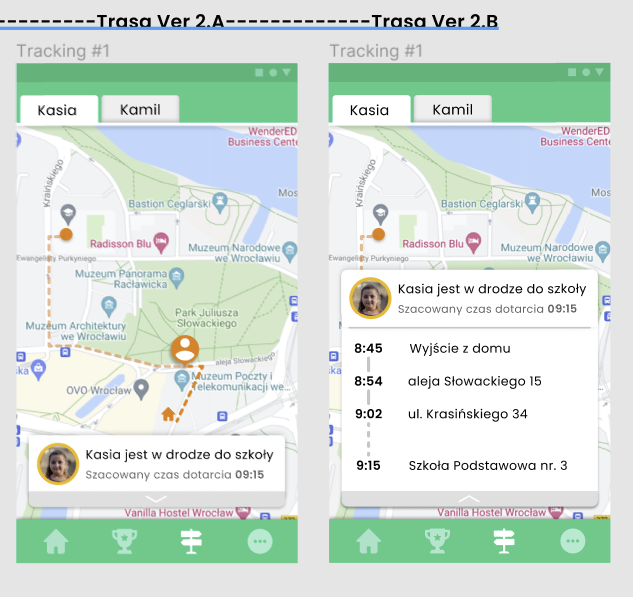
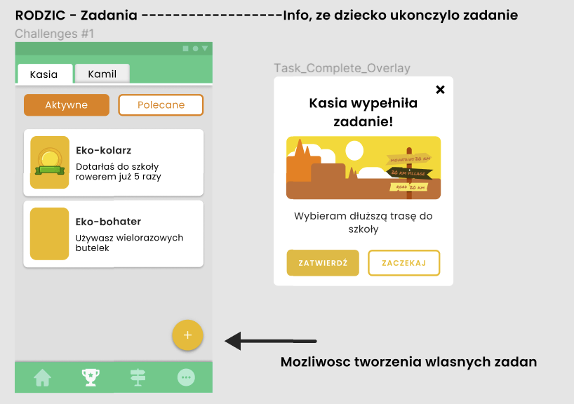

# _W kontakcie_

Prototyp jest demonstracją podstawowej funkcjonalności aplikacji w-kontakcie, 
która ma na celu poprawienie świadomości ekologicznej obywateli Wrocławia, 
poprzez poprawienie jakości relacji rodzic-dziecko i obustronne wzmacnianie wiedzy ekologicznej.
Odbywa się ona dzięki aplikacji, która pozwala na obserwację i analizę sposobu poruszania się 
dziecka z i do szkoły, wraz z nagradzaniem go za wybory ekologiczne, poprzez system gratyfikacji.
Dodatkową motywację stanowi możliwość porównywania swoich wyników z innymi dziećmi/rodzicami.

Trzonem aplikacji jest komunikator oparty na WebSocket.
Kiedy mowa o komunikatorze, nie chodzi o chat w sensie dosłownym, 
a sposób wymiany informacji między dwoma użytkownikami - dzieckiem i rodzicem. Dziecko i rodzic otrzymują powiadomienia o aktywności drugiego. 
Np. system, na podstawie lokalizacji dziecka, przesyła do rodzica informację: "Syn dotarł do szkoły o 8:20", a do syna: "Gratulacje! Właśnie otrzymałeś od taty odznakę Eko-zbieracza".
Innymi słowy: dziecko komunikuje swojemu rodzicowi za pomocą swojego zachowania - nie musi nic pisać, żeby rodzic otrzymał od dziecka wiadomość, że jest 1km od szkoły, 
lub też że wybrał ekologiczny środek transportu.

Tak wygenerowane informacje mogą stanowić twardą bazę analityczną dla miasta Wrocław. 

Aplikacja w obecnym kształcie skupia się przede wszystkim na rozwoju back-endu, 
front-end jest webowy i pozwala na zasymulowanie znalezienia się dziecka w różnych miejscach,
a zatem - różnych scenariuszy komunikatów i nagród.

Docelowo, aplikacja mobilna będzie napisana w React Native.

Tworzone API, które będzie udostępniać dane na temat istniejących we Wrocławiu placówek i wypadków w ich okolicach, 
posłużą do ulepszenia rekomendacji dotyczących środku transportu.

**Aktualna funkcjonalność:**

Aplikacja jest komunikatorem działającym w przeglądarce. W celu symulowania komunikacji rodzic-dziecko należy odpalić aplikację w dwóch osobnych oknach.
W folderze server znajduje się napoczęta logika dla pobierania danych pogodowych, lokalizacyjnych, dotyczących zanieczyszczenia powietrza oraz dostępnych w okolicy ekologicznych środków transportu.
W folderze client znajduje się widok aplikacji.

W celu uruchomienia aplikacji należy zainstalować wymagane pakiety (npm install), 
a następnie uruchomić aplikację (npm start) i wejść pod adres http://localhost:3000/
w dwóch osobnych oknach przeglądarki. Przyciski 'location', 'home location', 'school location'
, 'nearest bike', 'weather' oraz 'air pollution' symulują mechanizmy, które będą działały w sposób automatyczny w aplikacji docelowej, tj. na podstawie danych pobranych dla tych parametrów następuje przekazanie informacji do rodzica o aktywności dziecka oraz rekomendacjach związanych z wyborem środka transportu.

W folderze api znajduje się kod źródłowy dla api danych z Miasta.

**Docelowa funkcjonalność:**

Makiety przedstawiające aplikację w docelowej formie, znajdują się na dole dokumentu.
Architekturę systemu prezentują zdjęcia znajdujące się na dole dokumentu.

1. Synchronizacja
   - Aplikacja wymaga zarejestrowania się zarówno rodzica, jak i dziecka
   - Dziecko paruje się z rodzicem poprzez zeskanowanie kodu QR (na kształt integracji telefonu z komputer w WhatsApp)
   - Aplikacja wymaga włączonej lokalizacji i internetu po stronie dziecka, w czasie gdy przechodzi z/do szkoły
2. Background - aplikacja sprawdza, czy dziecko dotarło do szkoły.
   - Aplikacja automatycznie sprawdza lokalizację dziecka w ustalonych godzinach, 
   np. od 8:00 do 8:45
   - Jeśli dziecko dotrze na wskazane w aplikacje miejsce (z początku dwie podstawowe: dom i szkoła), do rodzica zostaje przesłany komunikat.
   - Jeśli dziecko nie dotrze na czas, rodzic otrzyma komunikat, a dziecko - punkty ujemne/zapytanie
4. Integracje:
   - Jakość powietrza (Airly) https://developer.airly.org/pl/docs
   - Hulajnogi (Tier/Hive/Bolt/...) https://github.com/ubahnverleih/WoBike
   - Pogoda https://rapidapi.com/visual-crossing-corporation-visual-crossing-corporation-default/api/visual-crossing-weather/

   - Trasa piesza (Google Maps) https://developers.google.com/maps/documentation/directions/overview
5. Output
    - Kalkulator, ile zanieczyszczeń udało się uniknąć
    - Poziomy/odznaczenia za działalność zgodną z rekomendacjami ekologicznymi
    - Sprawdzenie, czy przy wybranej szkole zdażają się wypadki. 
   Jeśli tak, to jak często i czy szczególnie w analogicznym okresie 
   https://www.wroclaw.pl/portal/szkolna-ulica
   
6. W przyszłości:
   - Automatyczne komunikaty, gdy dziecko np. przejdzie pierwszy 1km trasy (z 3km)
   - Komunikat o wybranym środku transportu (na podstawie prędkości poruszania się)
   - Rekomendacja (publiczny środek transportu/hulajnoga/rower/piechota) na podstawie:
     - jakości powietrza
     - korków
     - poziomu hałasu

